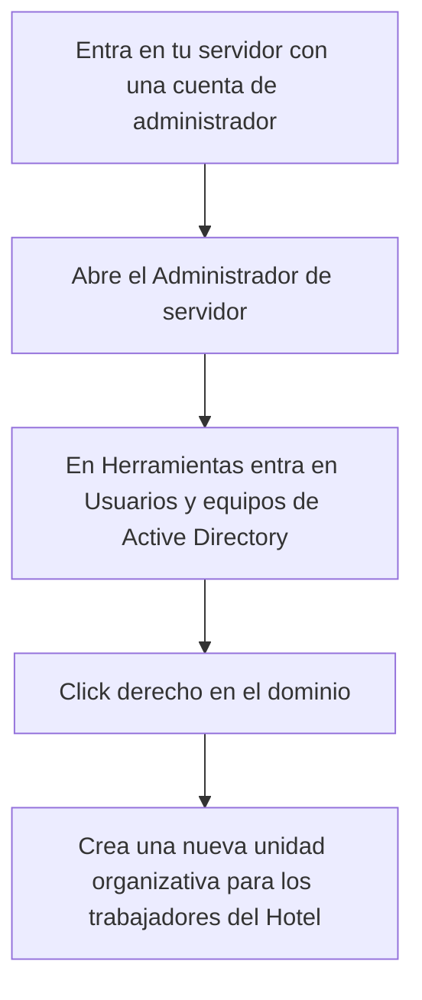

# Creación de Cuentas Operativas

```mermaid
flowchart TD
A[Entra en tu servidor con una cuenta de administrador]-->B[Abre el Administrador de servidor]
B-->C[En Herramientas entra en Usuarios y equipos de Active Directory]
C-->D[Click derecho en el dominio]
D-->E[Crea una nueva unidad organizativa para los trabajadores del Hotel]
```
