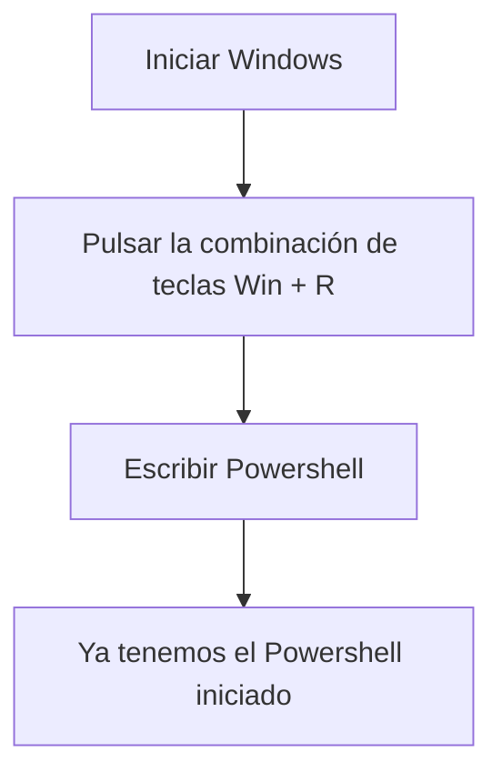

# 1. Activitats

L’objectiu d’aquesta activitat és que penseu en la possibilitat d’instal·lar Microsoft Windows Server 2019 en el vostre equip tenint en compte els requeriments suggerits.

El Microsoft Windows Server 2019 aconsella un maquinari amb unes característiques mínimes determinades:

| **Component**        | **Requisit**                                      |
|-----------------------|--------------------------------------------------|
| Processador           | Com a mínim necessitareu 1,4 GHz (processador x64). |
| Memòria RAM           | Com a mínim 512 MB                              |
| Disc dur              | Com a mínim 32 GB                               |
| Sortida estàndard     | Com a mínim Super VGA (1024 x 768)              |
| Altres                | Teclat i ratolins compatibles amb Microsoft.     |

# Poweshell

# Administrant  el servidor
| **Informació de l'equip**     | **Valor** |
|-------------------------------|--------------------------------------|
| Nom complet de l’equip	      | SRV-WIN2019.local                    |
| Domini o grup de treball	    | WORKGROUP                            |
| CPU i RAM instal·lada	        | Intel Xeon E5-2620 v4 @ 2.10GHz — 16 GB RAM. |
| IP actual	                    | 192.168.1.25                         |
| Identificador del producte    | 00430-10000-00000-AA123              |
