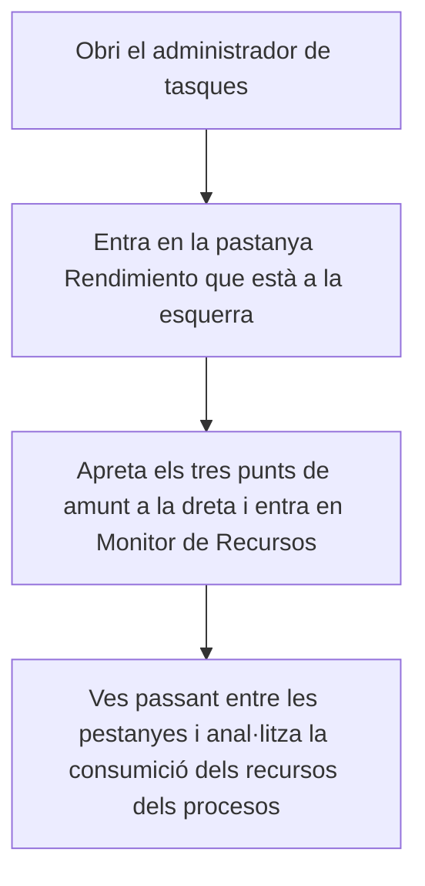
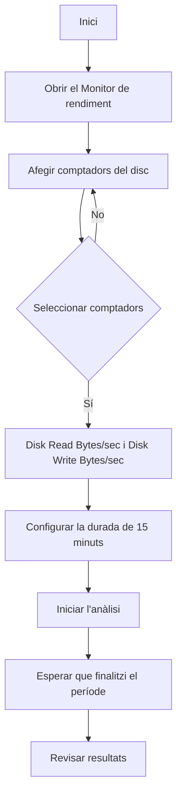

# 2. Activitats
# Monitor de recursos

```mermaid
flowchart TD
A[Obri el administrador de tasques]-->B[Entra en la pastanya Rendimiento que està a la esquerra]
B-->C[Apreta els tres punts de amunt a la dreta i entra en Monitor de Recursos]
C-->D[Ves passant entre les pestanyes i anal·litza la consumició dels recursos dels procesos]
```

# Rendiment de l'equip

```mermaid
flowchart TD
    A[Inici] --> B[Obrir el Monitor de rendiment]
    B --> C[Afegir comptadors del disc]
    C --> D{Seleccionar comptadors}
    D -->|Sí| E[Disk Read Bytes/sec i Disk Write Bytes/sec]
    D -->|No| C
    E --> F[Configurar la durada de 15 minuts]
    F --> G[Iniciar l'anàlisi]
    G --> H[Esperar que finalitzi el període]
    H --> I[Revisar resultats]
```
