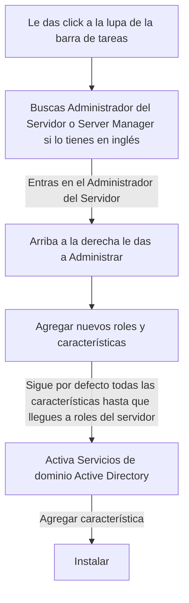
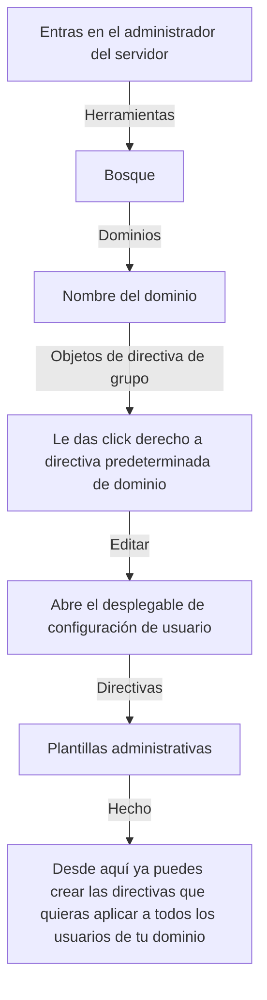

# 3. Activitats
# Creació d´un bosc nou

```mermaid
flowchart TD
A[Le das click a la lupa de la barra de tareas]
A-->B[Buscas Administrador del Servidor o Server Manager si lo tienes en inglés]
B-->|Entras en el Administrador del Servidor| C[Arriba a la derecha le das a Administrar]
C-->D[Agregar nuevos roles y características]
D-->|Sigue por defecto todas las características hasta que llegues a roles del servidor| E[Activa Servicios de dominio Active Directory]
E-->|Agregar característica| F[Instalar]
```

# Configuración de los directorios de grupo

```mermaid
flowchart TD
G[Entras en el administrador del servidor]
G-->|Herramientas|H[Bosque]
H-->|Dominios|I[Nombre del dominio]
I-->|Objetos de directiva de grupo|J[Le das click derecho a directiva predeterminada de dominio]
J-->|Editar|K[Abre el desplegable de configuración de usuario]
K-->|Directivas|L[Plantillas administrativas]
L-->|Hecho|M[Desde aquí ya puedes crear las directivas que quieras aplicar a todos los usuarios de tu dominio]
``` 
