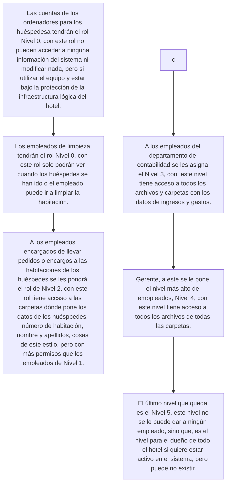

## Tarea 1: Clasificación de Roles de Seguridad
### Aquí vamos a gestionar el poder que tendrán las cuentas en el sistema del hotel.

## Tarea 2: Inventario y Planificación de Recursos
Para el hotel se necesitarán ordenadores según el número de empleados y habitaciones, por cada habitación un ordenador, y luego por cada empleado un ordenador y si es un empleado que tiene que estar en constante movimiento por el hotel una tablet que, o esté vinculada al ordenador de ese empleado que va a ejecutar los procesos o que la misma tablet esté en la estructura del sistema. Además habrá una impresora por cada empleado que esté en oficina, que no se esté moviendo durante todo el día.
