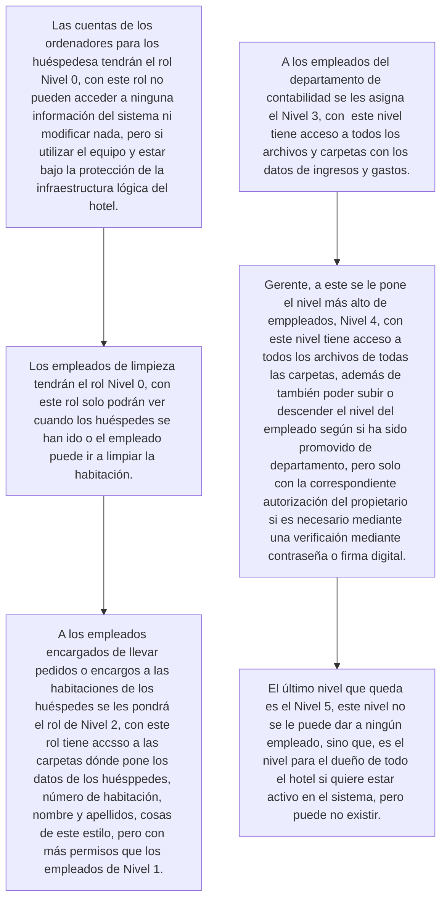

## Tarea 1: Clasificación de Roles de Seguridad
### Aquí vamos a gestionar el poder que tendrán las cuentas en el sistema del hotel.

## Tarea 2: Inventario y Planificación de Recursos
Para el hotel se necesitarán ordenadores según el número de empleados y habitaciones, por cada habitación un ordenador, y luego por cada empleado un ordenador y si es un empleado que tiene que estar en constante movimiento por el hotel una tablet que, o esté vinculada al ordenador de ese empleado que va a ejecutar los procesos o que la misma tablet esté en la estructura del sistema. Además habrá una impresora por cada empleado que esté en oficina, que no se esté moviendo durante todo el día.

## Tarea 3: Aplicación de Permisos de Carpeta
Todas las carpetas Tendrán los permisos de las carpetas según los roles explicados anteriormente, según los "Niveles", cada nivel tendrá permisos direfentes al anterior, cada permiso de más alto nivel que el anterior, hasta el Nivel 4 que podrá hacerlo todo.

## Tarea 4: Despliegue del Servicio de Impresión
Aquí Las impresoras estarán todas conectadas al servidor del hotel, y el mismo gestionará las peticiones de los ordenadores de imprimir según si hay impresoras libres y quien haya pedido hacerlo primero.

## Tarea 5: Determinación de la Seguridad Resultante
Con todo esto configurado se podría decir que es bastante seguro, los huéspedes no tienen acceso a nada importante, solo a utilizar el ordenador, además de que no pueden hacer ninguna petición sobre archivos.

## Tarea 6: Validación de Acceso Funcional
En este sistema los empleados de todos los niveles superiores al 1, es decir, el 2, 3, y 4. Los empleados del Nivel 2 ya pueden tener peligro si alguien tiene malas intenciones, pero no tan vulnerable como un sistema en el que en cualquier dispositivo si pones cierta contraseña ya tienes los permisos correspondientes al nivel del que es esa contraseña, además no es un sistema abierto a internet de por sí, porque las personas con más peligro y las que más van a acceder a internet son los huéspedes, que no tienen ninguna información, los empleados no van a acceder a internet a través de los dispositivos de trabajo, sino que, a través de sus dispositivos personales y con sus datos si lo requieren. Luego, la conexión a internet de los dispositivos de los huéspedes es a través de cable, no por una contraseña, que el router o servidor que va a proporcionar la conexión tiene que tener el servicio de Wi-Fi, pero con contraseña, que nadie que no sea el Gerente sabe, y el huésped no necesita saber.
