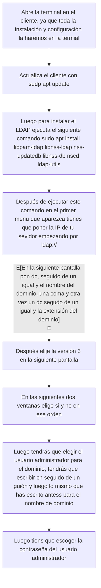

# Instalación, configuración y gestión de OpenLDAP
## Previo a instalar OpenLDAP
Antes de ponernos a instalar el OpenLDAP, pero ya con la máquina ubuntu sin interfaz gráfica, tendremos que hacer la configuración de la dirección IP de nuestra máquina, la máquina, como mínimo, tiene que tener un adaptador, cuando ya estés en la línea de comandos ,ejecuta el siguiente comando: sudo nano /etc/netplan/50-cloud-init.yaml. Y cuando estés dentro de ese fichero, escribe lo siguiente.

Después de haber hecho esto, pulta "control + X", luego "y" y por último "enter". Después de pulsar estos botones en ese orden en la línea de comando escribe "sudo netplan apply" y comprueba si ha sido efectiva la modificación con "ip address". Si los cambios no se han efectuado prueba a reiniciarlo con "sudo reboot", y ya deberían de haberse hecho los cambios, si no es así revise el fichero netplan, y si nada de esto funciona, probablemente su máquina este corrupta.

## Servidor

## Instalación
Para realizar la instalación primero ejecutaremos "audo apt update" para actualizar el sistema, después de que haya acabado la actualización ejecutaremos "sudo apt install slapd ldap-utils", con este comando instalaremos el OpenLDAP. Después de ejecutar el comando aparecerá la siguiente pantalla:

Aquí pondrás la contraseña que quieras, mi recomendación es que pongas la misma que tienes para ingresar en la cuenta de administrador.


## Configuración
Ahora para configurar el slapd, ejecutamos el comando "sudo dpkg-reconfigure slapd", al ejecutar el comando aparecerá la siguiente pantalla preguntándonos si queremos omitir la configuración de slapd, elegiremos que No.


Luego eliges el nombre que quieres que tenga tu dominio.


También el nombre de organización.


Después de eso también te pedirá la contraseña del administrador, recomiento personalmente que pongas la misma todo el rato si es un sistema que no va a lanzarse, un sistema de prueba, de esta forma no te olvidarás de ninguna contraseña.

Luego te preguntará si quieres uqe borre la base de datos en caso de purgado, elegimos que no.


Seguido de lo anterior te dirá que existen archivos antiguos, te dirá que tiene que moverlos, le damos a Sí.


Ahora ya tenemos nuestro servidor OpenLDAP instalado y configuración.

## Gestión
Vamos a crear un grupo y una unidad organizativa. Para crear y entrar en el archivo que vamos a modificar ejecutaremos el comando "sudo nano grup.ldif". El fichero tienen que acabar parecido a este.

Después añadimos el grupo con el comando "sudo ldapadd -x -D cn=admin,dc=SORdom,dc=org -W -f grup.ldif", pones la contraseña que si me has hecho caso has estado poniendo todo el rato y ya.

### Incidencia
Si no te deja es porque el LDAP no tiene tu usuario ni contraseña, si es así, sigue estos pasos para solucionarlo:
  1. Ejecuta slappasswd. Pon la contraseña que quieras usar, te devolverá un código hash que empieza por "{SSHA}", cópialo o hazle una captura porque lo vamos a necesitar más tarde.
  2. sudo nano admin.ldif. Tiene que quedar algo así:

Donde pone "{SSHA}" tienes que escribir lo que te he dicho antes que copies o le hagas una foto/captura.

  4. Aplícalo con este comando "sudo ldapmodify -Y EXTERNAL -H ldapi:/// -f admin.ldif".
  5. Finalmente ya podrás ejecutar el comando con el que añadirás el fichero grup.ldif a la base de datos.

### - Fin incidencia -

Ahora vamos a crear un usuario que va a formar parte del grupo que acabamos de añadir a la base de datos, empezamos ejecutanto el comando "sudo nano usuarios.ldif" para crear y entrar en el fichero que editaremos para definir la información del usuario. Tendrá que quedar como en la siguiente imagen.

Luego de esto volvemos a hacer lo mismo que hemos hecho antes para añadir el grupo a la base de datos del LDAP. "sudo ldapadd -x -D cn=admin,dc=SORdom,dc=org -W -f usuarios.ldif".

## PHPLDAPAdmin

Instalamos el php con el comando "sudo apt install phpldapadimin"


Ahora ejecutamos "sudo nano /usr/share/phpldapadmin/config/config.php" Aquí modificaremos si queremos el nombre de dominio, de nuestro servidor y administrador si queremos, em mi caso lo voy a dejar de la siguiente forma:


Después de esto podremos entrar desde otro ordenador que esté conectado a la misma red escribiendo en la barra del navegador esto: "http://IP_del_servidor/phpldapadmin", podrás el "cn" que hayas estado poniéndo antes, y los dos "dc" que has estado poniéndo antes. Y de esta forma podrás modificar y editar el LDAP de forma gráfica.


## Cliente

## Instalación


En caso de haberte equivocado en algo puedes volver a configurarlo con el comando "dpkg-reconfigure ldap-auth-config".

```mermaid
flowchart TD
A[Entra a editar el fichero /etc/nsswitch.conf con nano]-->B[Donde pone passwd, group y shadow tienes que poner files ldap, y donde pone hosts, files dns]
B-->C[Después de esa configuración tienes que actualizar la información de usuarios y grupos de LDAP con el comando sudo nss_updatedb ldap]
C-->D[Si no se han aplicado los cambios entra en el fichero /etc/ldap.conf y revisa que el nombre de dominio y la IP estén correctos]
D-->E[Ejecuta el siguiente comando para actualizar las políticas de autenticación predeterminadas: sudo pam-auth-update]
E-->F[Tiene que estar todo seleccionado]
F-->G[Si te pide que cambies las contraseñas de los usuarios tienes que entrar en el fichero /etc/pam.d/common-password, y donde pone password [success=1 tienes que dejar solo eso.]
```
